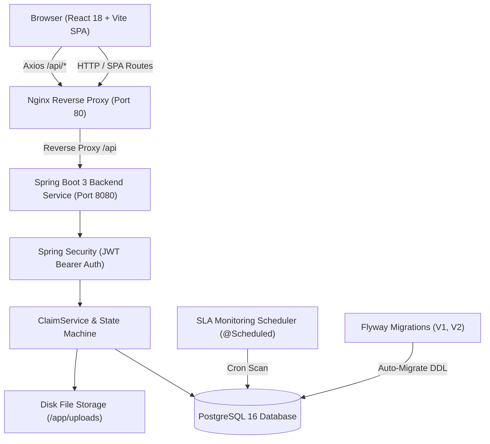

# Insurance Claims Processing Portal

A production-ready full-stack enterprise platform for insurance policyholders, claims processing handlers, and managers. Policyholders file claims against active policies and upload supporting documentation. Claim handlers review submitted claims, request additional information, or approve/reject payouts. Managers oversee an interactive SLA turnaround dashboard to identify and reassign claims at risk of breaching turnaround SLAs.

---

## Technical Architecture & Design



---

## Key Tech Stack

- **Backend**: Java 17, Spring Boot 3.2, Maven, Spring Data JPA, Hibernate, Spring Security (JWT)
- **Database & Migrations**: PostgreSQL 16, Flyway Migrations (`ddl-auto: validate`)
- **Frontend**: React 18, Vite, React Router v6, Axios (Interceptor), Recharts, Tailwind CSS, Lucide Icons
- **DevOps & Containers**: Docker, Docker Compose (Multi-stage Dockerfiles), Nginx Reverse Proxy
- **Testing**: JUnit 5, Mockito, Testcontainers (PostgreSQL 16), AssertJ, JaCoCo Coverage Report
- **Quality**: Clean Architecture (Package-by-Feature), Strict Layering (`controller -> service -> repository`), MapStruct DTO Mappers, `@Version` Optimistic Concurrency Control

---

## Domain Model & State Machine

### Domain Model
1. **User**: `id`, `email` (unique), `passwordHash`, `fullName`, `role` (`CUSTOMER` | `HANDLER` | `MANAGER`), `createdAt`
2. **Policy**: `id`, `policyNumber` (unique), `type` (`HEALTH` | `MOTOR` | `LIFE` | `PROPERTY`), `coverageAmount`, `premium`, `validFrom`, `validTo`, `holder` (`ManyToOne -> User`)
3. **Claim**: `id`, `claimNumber` (unique, format `CLM-YYYY-NNNNNN`), `incidentDate`, `description`, `claimedAmount`, `approvedAmount`, `status`, `policy` (`ManyToOne`), `assignedHandler` (`ManyToOne -> User`), `version` (Optimistic locking), `createdAt`, `submittedAt`, `closedAt`
4. **ClaimDocument**: `id`, `fileName`, `contentType`, `sizeBytes`, `storagePath`, `uploadedAt`, `claim` (`ManyToOne`)
5. **ClaimAuditLog**: `id`, `claim` (`ManyToOne`), `fromStatus`, `toStatus`, `actorId`, `remarks`, `timestamp`

### Claim State Machine Transition Matrix
```
[DRAFT] -------> [SUBMITTED] -------> [UNDER_REVIEW] -------> [APPROVED] -------> [SETTLED]
                                           |                      |
                                           v                      v
                                   [INFO_REQUESTED]           [REJECTED]
```

- `DRAFT -> SUBMITTED`
- `SUBMITTED -> UNDER_REVIEW`
- `UNDER_REVIEW -> INFO_REQUESTED` | `APPROVED` | `REJECTED`
- `INFO_REQUESTED -> UNDER_REVIEW`
- `APPROVED -> SETTLED`
- Terminal States: `REJECTED`, `SETTLED`

*Note: Any unpermitted transition throws `InvalidStateTransitionException`, mapped to HTTP 409 Conflict.*

---

## Local Development & Setup Instructions

### Prerequisites
- Docker & Docker Compose
- JDK 17 (for local CLI Maven builds)
- Node.js 18+ (for local frontend dev)

### Option 1: Single-Command Docker Compose (Recommended)

Bring up PostgreSQL 16, Spring Boot backend, and Nginx React frontend in containerized multi-stage builds:

```bash
docker compose up --build
```

Access the application in your browser:
- **Frontend SPA**: `http://localhost`
- **Backend API**: `http://localhost/api` (or `http://localhost:8080/api`)

### Demo Credentials

| Role | Email | Password |
| :--- | :--- | :--- |
| **Policyholder (Customer)** | `customer@example.com` | `password123` |
| **Claims Handler** | `handler@example.com` | `password123` |
| **Claims Manager** | `manager@example.com` | `password123` |

---

### Option 2: Running Locally for Development

1. **Start PostgreSQL Container**:
   ```bash
   docker compose up -d postgres
   ```

2. **Run Backend Application**:
   ```bash
   mvn spring-boot:run
   ```

3. **Run Frontend Dev Server**:
   ```bash
   cd frontend
   npm install
   npm run dev
   ```

4. **Run Backend Test Suites**:
   - **Exhaustive State Machine Matrix Unit Tests (49 Pairs)**:
     ```bash
     mvn test -Dtest=ClaimStateMachineTest
     ```
   - **Optimistic Locking Concurrency Tests**:
     ```bash
     mvn test -Dtest=ClaimConcurrencyTest
     ```
   - **Full Verification & Testcontainers Suite**:
     ```bash
     mvn verify
     ```

---

## API Reference Documentation

### Authentication (`/api/v1/auth`)
- `POST /api/v1/auth/login`: Authenticate and receive JWT Bearer token
- `POST /api/v1/auth/register`: Register new user account
- `GET /api/v1/auth/me`: Get current authenticated user details

### Policies (`/api/v1/policies`)
- `POST /api/v1/policies`: Create new policy (Manager/Handler)
- `GET /api/v1/policies/{id}`: Fetch policy details
- `GET /api/v1/policies?holderId={id}&page=0&size=20`: List policies with pagination

### Claims (`/api/v1/claims`)
- `POST /api/v1/claims`: File a new claim (Customer)
- `POST /api/v1/claims/{id}/submit`: Submit draft claim for review
- `PATCH /api/v1/claims/{id}/status`: Transition claim status (`UNDER_REVIEW`, `APPROVED`, etc.)
- `PATCH /api/v1/claims/{id}/reassign`: Reassign claim handler (Manager only)
- `GET /api/v1/claims/{id}`: Fetch claim details
- `GET /api/v1/claims?status={status}&policyType={type}&page=0&size=20`: List claims with JPA Specification filters
- `GET /api/v1/claims/{id}/audit-logs`: Fetch claim audit history timeline

### Documents (`/api/v1`)
- `POST /api/v1/claims/{claimId}/documents`: Upload supporting document (Multipart PDF/PNG/JPEG <= 10MB)
- `GET /api/v1/claims/{claimId}/documents`: List attached documents
- `GET /api/v1/documents/{documentId}/download`: Stream file download

### SLA Dashboard (`/api/v1/dashboard`)
- `GET /api/v1/dashboard/sla`: Fetch SLA turnaround metrics, status distribution, and breached/at-risk claims (Manager/Handler)
